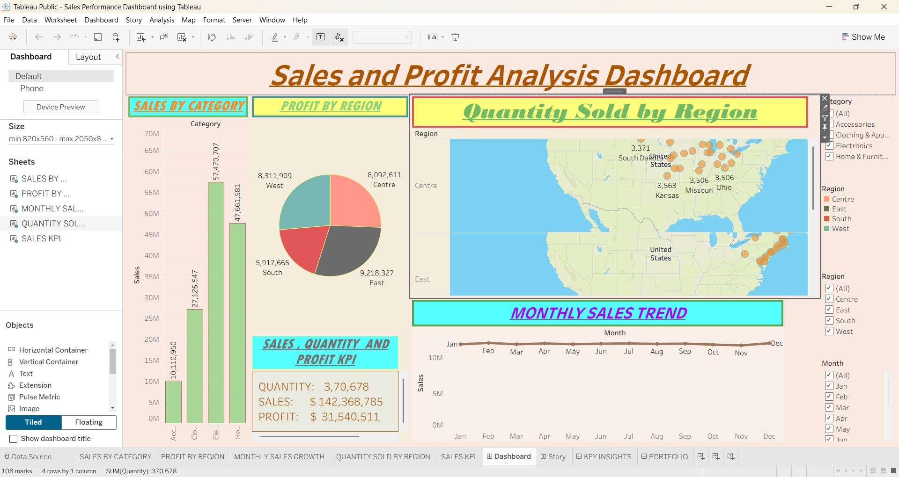

# Sales Performance Dashboard using Tableau

## 📌 Project Overview
This project is a Sales Performance Dashboard created using Tableau to analyze and visualize sales data effectively. The dashboard helps in understanding business performance through interactive charts, KPIs, and filters.

## 🎯 Objective
The objective of this project is to transform raw sales data into meaningful visual insights that support better business decision-making.

## 📊 Features
- Interactive Tableau Dashboard
- Region-wise Sales Analysis
- Profit and Quantity Tracking
- Category & Sub-Category Performance
- Monthly Sales Trend Analysis
- Dynamic Filters for Better Exploration
- KPI Metrics Visualization

## 🛠️ Tools & Technologies Used
- Tableau
- Data Visualization
- Business Analytics
- Dashboard Design

## 📈 Dashboard Insights
- Technology category generated the highest sales.
- North region achieved maximum profit.
- Sales performance increased during peak seasons.
- Furniture category showed lower profit margins compared to others.

## 📂 Project Files
- Sales Performance Dashboard.twb
- Dataset used for visualization
- Dashboard screenshots

## 🚀 How to Use
1. Download the `.twb` file.
2. Open it using Tableau Desktop/Public.
3. Explore the dashboard using filters and charts.

## 📷 Dashboard Preview

   

## 📚 Learning Outcome
This project improved my skills in:
- Data Visualization
- Dashboard Development
- Business Intelligence
- Tableau Analytics

## 👨‍💻 Author
Jayanta Chakraborty
